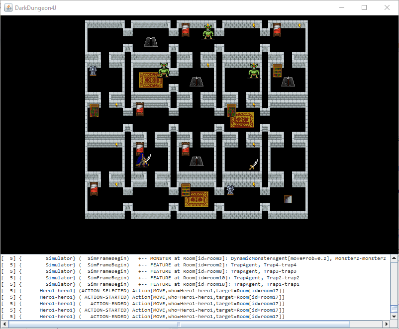

# CLEAR
Small 2D single-threaded bloat-free game library without ANY external dependencies; pure Java "based" on Swing (well, we just need a JFrame, JPanel and BufferedImage).
Check how [quick is to setup a C2D frame](Clear2D/src/test/java/cz/cuni/amis/clear2d/tests/Test04_C2DFrame.java). Using [Maven](https://maven.apache.org/).
The project is ideal for creating fast sprite-based visualizations of small, e.g., AI, projects and showcases.

## FEATURES

Minimalistic set of framework functionalities:
* hierarchical scene tree ~ [Scene](Clear2D/src/main/java/cz/cuni/amis/clear2d/engine/Scene.java)
* component-based scene element ~ [SceneElement](Clear2D/src/main/java/cz/cuni/amis/clear2d/engine/SceneElement.java), [Component](Clear2D/src/main/java/cz/cuni/amis/clear2d/engine/Component.java)
  * scene element enabled/ticking/visible can be controlled - affects the whole sub-tree
  * scene elements can be extended ~ [Sprite](Clear2D/src/main/java/cz/cuni/amis/clear2d/engine/prefabs/Sprite.java), [Entity](Clear2D/src/main/java/cz/cuni/amis/clear2d/engine/prefabs/Entity.java)
  * event-based functionalities (render, tick), extensible
* [Texture](Clear2D/src/main/java/cz/cuni/amis/clear2d/engine/textures/Texture.java), [Subtexture](Clear2D/src/main/java/cz/cuni/amis/clear2d/engine/textures/Subtexture.java), [TextureAtlas](Clear2D/src/main/java/cz/cuni/amis/clear2d/engine/textures/TextureAtlas.java), [AnimatedTexture](Clear2D/src/main/java/cz/cuni/amis/clear2d/engine/textures/AnimatedTexture.java)
* spritesheet-based úFontAtlas](Clear2D/src/main/java/cz/cuni/amis/clear2d/engine/fonts/FontAtlas.java), scene element [Text](Clear2D/src/main/java/cz/cuni/amis/clear2d/engine/prefabs/Text.java)
  * contains set of monospaced fonts [C2DFonts](Clear2D/src/main/java/cz/cuni/amis/clear2d/engine/fonts/C2DFonts.java)
* basic position tweening ~ [TweenPos](Clear2D/src/main/java/cz/cuni/amis/clear2d/engine/tween/pos/TweenPos.java), inspired by [TweenLite](https://greensock.com/tweenlite)
* separated game and real time flow, controlable speed ~ [C2DTime](Clear2D/src/main/java/cz/cuni/amis/clear2d/engine/time/C2DTime.java)
* concurrent-modification-exception List implementation ~ [ConcurrentList](Clear2D/src/main/java/cz/cuni/amis/clear2d/engine/collections/ConcurrentList.java)
  * you do not have to worry about adding/removing scene element / components from within the same thread / different threads during runtime
* Swing-based [C2DPanel](Clear2D/src/main/java/cz/cuni/amis/clear2d/engine/C2DPanel.java) you can blend with other Swing components
  * easy to port (we just need a canvas where to paint [Camera](Clear2D/src/main/java/cz/cuni/amis/clear2d/engine/Camera.java)'s [RenderTarget](Clear2D/src/main/java/cz/cuni/amis/clear2d/engine/RenderTarget.java))

## EXAMPLE SCREENSHOT

## MAVEN [REPOSITORY](http://diana.ms.mff.cuni.cz:8081/artifactory)

    <repository>
        <id>amis-artifactory</id>
        <name>AMIS Artifactory</name>
        <url>http://diana.ms.mff.cuni.cz:8081/artifactory/repo</url>
    </repository>
    
## MAVEN DEPENDENCY

    <dependency>
        <groupId>cz.cuni.amis</groupId>
	    <artifactId>clear-2d</artifactId>
	    <version>0.0.1-SNAPSHOT</version>
    </dependency>
    
